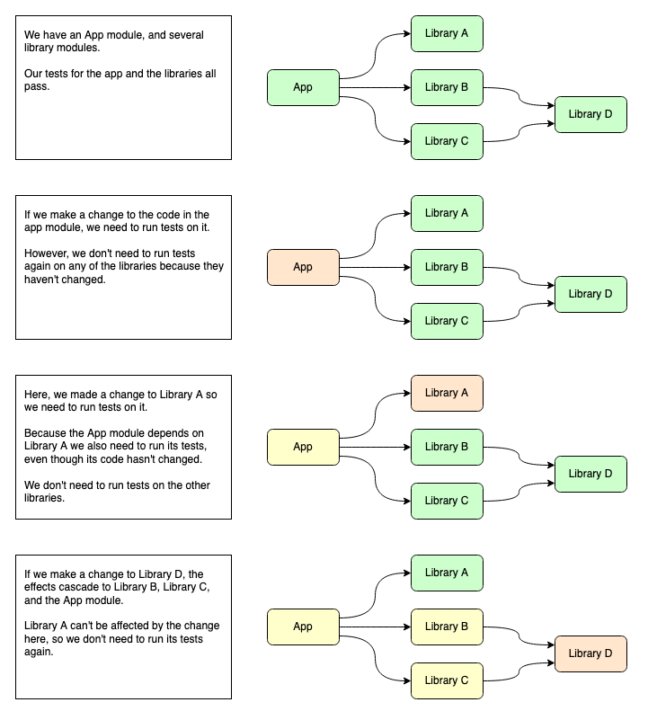

# Scrimp

## About

> **scrimp**
  *verb*
  be thrifty or parsimonious; economize.

Scrimp is a Gradle plugin designed to only run tests when your code actually changes.

The plugin analyses which modules have been impacted by changes in source control, and lets you run tests (or any tasks you like) on just those modules.

It is particularly suited for multi-module Android projects, which use instrumented tests.


## Why is this needed?

### The general case

Projects of all sizes can benefit from reduced cycle times. For many development and CI workflows, the slowest part of the process is running tests.

Gradle has [up-to-date checks](https://docs.gradle.org/current/userguide/more_about_tasks.html#sec:up_to_date_checks) and the [Build Cache](https://docs.gradle.org/current/userguide/build_cache.html), both of which are designed to avoid repetition of work, by caching task outputs which can be reused when the task inputs have not changed. These are both great tools, but they both have a number of limitations:

1. CI systems typically use "clean" builds, so tasks are never considered up-to-date.
2. You may not be able to use the Build Cache, for technical or organisational reasons.

### On Android

If you are developing for Android, instrumented tests are particularly problematic.

* They are [not cacheable](https://issuetracker.google.com/issues/115873051) by Gradle.
* They are slow.
* They can be flaky.

For these reasons, running instrumented tests locally can lead to a lot of wasted developer time, and running them in CI environments can get expensive quickly.


## How it works

### Overview

Given a commit reference, Scrimp can:

1. Establish which files have changed since the given commit, and which modules those files belong to.
2. Work out which modules depend on *those* modules (and so on...).

If given a set of tasks to be run for each module, Scrimp can run the tasks on affected modules.

### Example




## Usage

### Apply the plugin

In your top-level build.gradle:

```groovy
buildscript {
    repositories {
        maven { url "https://jitpack.io" }
    }
    dependencies {
        classpath 'com.github.vaughandroid:scrimp:0.1.1'
    }
}

apply plugin: 'scrimp'
```

### Run tests on impacted modules

This is the most straightforward "out of the box" way to use Scrimp. It will attempt to run all the given tasks on any modules which have changed or which have been impacted by changes to their dependencies.

`./gradlew scrimpRun -PscrimpTasks="<task list>" -PscrimpExtraArgs="<extra Gradle arguments>" -PscrimpCommit=<commit ref>`

* The 'scrimpTasks parameter' is required, and should be a list of one or more task names separated by spaces. You can safely include the names of tasks which only exist for some modules.
* The 'scrimpCommit' parameter is optional, and will default to HEAD (i.e. changes since the last commit).
* The 'scrimpExtraArgs' parameter is optional, but can be a list of one or more additional Gradle parameters to use when running the tasks. e.g. "--parallel".

Example 1: Run tests on uncommitted changes:

`./gradlew scrimpRun -PscrimpTasks=test`

Example 2: Run tests and connected tests covering changes since commit `3b7e70c`:

`./gradlew scrimpRun -PscrimpTasks="test connectedCheck" -PscrimpCommit=3b7e70c`

### Analyse changed and impacted modules

If you need to apply some customisation - e.g. running different tasks for different modules - then Scrimp can produce a report of changed and impacted modules.

`./gradlew scrimpAnalyse -PscrimpCommit=<commit ref>`

This will output a file at `<build dir>/scrimp/module-analysis.json`.

* The 'scrimpCommit' parameter is optional, and will default to HEAD (i.e. changes since the last commit).

Example: Analyse changes since commit `3b7e70c`:

`./gradlew scrimpAnalyse -PscrimpCommit=3b7e70c`

### Getting a commit reference

This is outside the scope of the plugin, and you may wish to use different strategies in different circumstances.

When developing locally, you may wish to validate changes before each commit. In this case, you can not specify a commit and Scrimp will use `HEAD` by default.

For CI, the recommended strategy is to have a "known good" branch, which is updated by your CI when tests pass successfully on your main branch. You can then use `git merge-base HEAD <branch>` to find the most recent common ancestor of this branch and another branch. For example, if your "known good" branch is called "green" your CI might run:

`./gradlew scrimpRun -PscrimpTasks="test" -PscrimpExtraArgs="--parallel" -PscrimpCommit=$(git merge-base HEAD green)`


## Other tasks

### Output file with Gradle arguments

`./gradlew scrimpListTasks -scrimpCreateArgumentsFile="<task list> -PscrimpExtraArgs="<extra Gradle arguments>" -PscrimpCommit=<commit ref>`

### List tasks (but do not run them)

`./gradlew scrimpListTasks -PscrimpTasks="<task list>" -PscrimpCommit=<commit ref>`

This will output a file at `<build dir>/scrimp/filtered-tasks.txt`.

### Print module graph

`./gradlew scrimpPrintModuleGraph`

This will print a view of the module graph to the console.