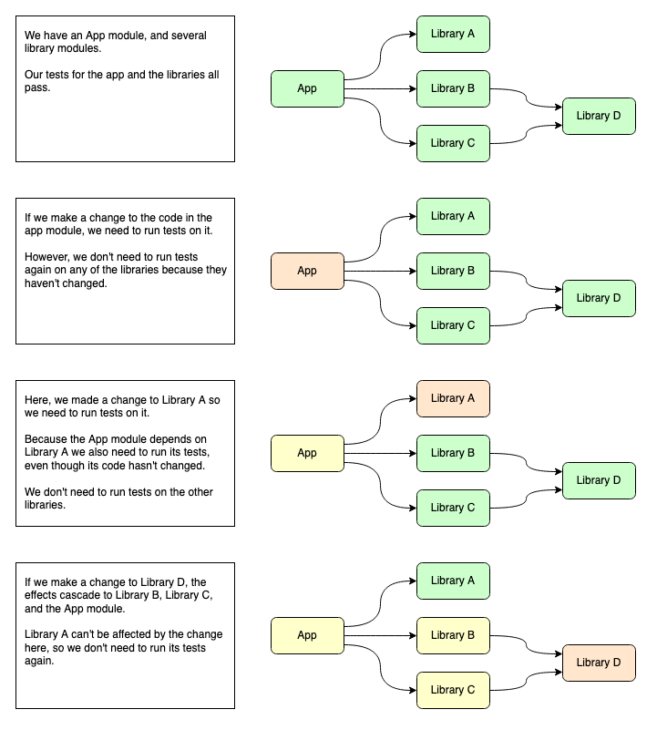

# How it works

## Overview

Given a commit reference, Scrimp can:

1. Establish which files have changed since the given commit, and which modules those files belong to.
2. Work out which modules depend on *those* modules (and so on...).

If given a set of tasks to be run for each module, Scrimp can run the tasks on affected modules.

## Example

## What if I edit files that aren't part of a submodule?

If the files aren't part of a submodule, Scrimp assumes that your whole project needs to be rebuilt - including all the submodules.

This is necessary because sometimes a top-level change can impact all the submodules.

In some cases - e.g. a change to your README.md - this results in a lot of unnecessary work being performed. There are [plans](https://github.com/vaughandroid/scrimp/projects/1#card-47730939) to make it possible to ignore certain files, so you can configure this for your particular project.

## What if I edit non-code files?

Scrimp doesn't differentiate between code and non-code files. All changes are considered impactful.
